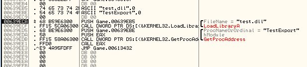

# [Part2] Hướng dẫn inject file DLL vào file Game.exe sử dụng Assembly.

Ở phần 1 mình đã hướng dẫn làm auto rao bán đồ đơn giản cho JX6. Tuy nhiên việc inject file dll vẫn làm thủ công. Ở phần 2 này mình sẽ hướng dẫn chỉnh sửa file Game.exe để nó tự động inject file auto đã viết. Các bạn cũng có thể viết miniskill hoặc anti-gì-đó... rồi inject bằng cách này.
- Ưu điểm: file Game.exe ko bị thay đổi nhiều, vẫn vào game trực tiếp như bình thường
- Nhược điểm: inject phức tạp hơn cách dùng C# hoặc C++. Ko mã hoá đc file dll cần inject.

Ở phần 3 mình sẽ hướng dẫn inject sử dụng C#.

https://www.youtube.com/@dtd25