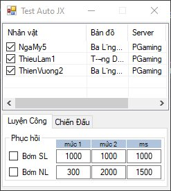
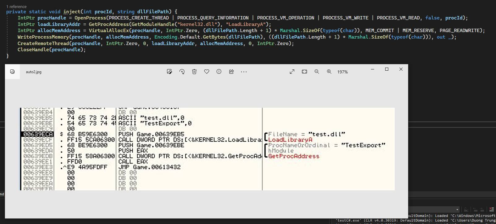
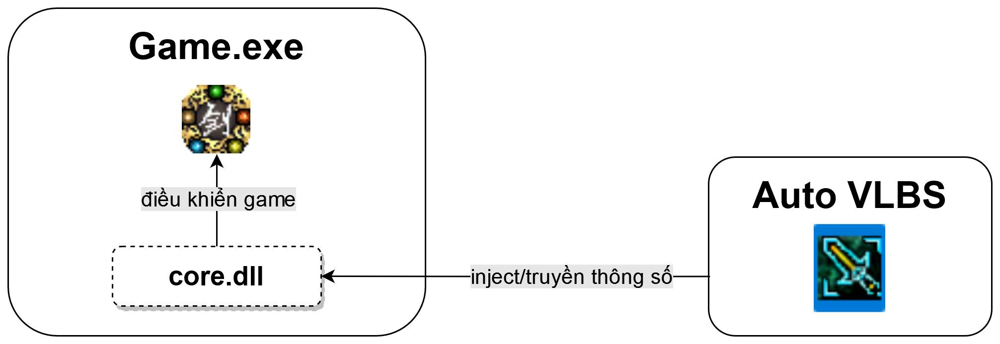

# [Part3] Hướng dẫn inject file DLL vào file Game.exe sử dụng C#.

Tiếp theo hướng dẫn sửa file Game.exe bằng assembly để inject DLL ở phần 2, Ở phần 3 này mình sẽ hướng dẫn inject DLL vào Game.exe bằng C# chỉ với 6 dòng code. Có thể thay bằng C++ cũng tương tự.

Ngoài ra mình có làm thêm 1 cái UI auto đơn giản, ai cần có thể nghiên cứu thêm.

- Ưu điểm:
    - File Game.exe hoàn toàn ko bị thay đổi.
    -Code C#/C++ có thể mở rộng để mã hoá file dll cần inject, tăng thêm 1 lớp bảo mật.
    -Nâng cao hơn thì việc inject có thể làm gần như tàng hình, hạn chế việc dump memory để trích xuất ngược lại file dll gốc và hạn chế việc debug file dll để cr@ck.
- Nhược điểm:
    -Cần chương trình thứ 3 để inject DLL dẫn đến việc vào game không trực tiếp (kiểu như JX8).

Tóm tắt: part2 thích hợp cho việc inject dll kiểu như miniskill, anti-dump còn part3 thích hợp cho việc inject dll của auto.

Ở phần 4 mình sẽ giới thiệu 1 con auto hoàn chỉnh cho JX8 do mình tự dev.

https://www.youtube.com/@dtd25